# 基于用户行为数据的智能健身房返积分促活机制设计

## 摘要

本文围绕智能健身房“有效线下锻炼 + 线上分享或互动”返积分机制设计问题，基于用户订单、到店、运动、线上互动和私教购买等历史数据，构建用户行为特征、会员续费预测模型、私教购买预测模型和候选积分策略综合评价模型。首先，依据商品名称、价格和订单信息识别会员商品、私教商品及其他入场权益，并构造用户月度行为特征和用户状态。其次，针对会员续费问题，采用有限观察窗口下的 Cox 生存模型处理右删失样本，并使用 Logistic-GAM、普通随机森林和状态增强随机森林进行预测对比。结果表明，普通随机森林具有略优的纯预测性能，状态增强随机森林在保持接近预测能力的同时，更便于承接用户状态、活跃提升空间和行为近因等运营解释变量，因此本文将其作为后续策略模拟中的续费概率推理模型。再次，针对私教购买极低频事件，构建增强私教购买模型，并通过特征消融、TopK 指标和先验校正验证其可作为高潜私教用户排序和策略模拟概率输入。

在积分策略设计部分，本文不直接将历史相关关系解释为积分干预因果效应，而是基于边际递减的积分响应函数构造情景模拟。积分策略首先改变用户活跃、无氧和互动等行为强度特征，并通过近因-粘性状态向量体现活跃改善后的联动变化，再分别调用状态增强随机森林和增强私教购买模型，得到策略后的续费概率和私教购买概率。随后，在平台利润非负和成本收入比约束下，对候选策略进行熵权-TOPSIS 综合评价。最新基准结果显示，S4 流失召回强化策略在两窗口综合评价中排名第一，平台利润和成本稳健性较强；S5 高强度综合激励策略排名第二，但在活跃提升、续费提升和私教收入提升方面更强。多延期窗口、$\kappa$ 语义更新参数和 TOPSIS 替代指标稳健性分析进一步表明：S4 更适合作为稳健主推荐，S5 适合作为平台愿意承担较高补贴时的进攻型备选，S3 私教转化强化策略则更适合作为私教专项定向策略。本文结果为智能健身房在提升用户活跃度、续费率和私教转化的同时控制积分成本提供了可复现的建模框架和策略依据。

**关键词：** 智能健身房；返积分机制；会员续费；私教购买；状态增强随机森林；熵权-TOPSIS；灵敏度分析

---

## 1 问题重述与背景分析

随着智能健身房和数字化健身平台的发展，平台逐渐能够记录用户的到店、运动、消费和线上互动行为。如何利用这些行为数据设计合理的积分激励机制，是提升用户活跃度、会员续费率和私教转化率的重要运营问题。赛题要求设计一种“有效线下锻炼 + 线上分享或互动”的返积分机制，积分只能用于下一期会员卡或私教卡抵扣，不可提现或转让。因此，积分策略既要提升用户活跃和消费转化，也要避免补贴过度导致平台利润下降。

本文需要解决的核心矛盾包括：一是通过积分激励提升线下锻炼和线上互动；二是提高会员续费和私教购买倾向；三是控制积分兑换成本；四是在平台经营约束下选择综合表现最优且可落地的候选策略。为此，本文构建“用户特征构造 - 续费/私教购买预测 - 积分响应模拟 - 经营约束筛选 - 熵权-TOPSIS 综合评价”的建模流程，并通过多类稳健性检验确定最终推荐策略。

---

## 2 模型假设与符号说明

### 2.1 模型假设

本文基于以下假设进行建模：

1. 会员商品有效期可以根据商品名称、商品类别和价格规则近似识别。
2. 用户在会员权益结束后 $H$ 天内再次购买会员类商品，视为窗口内续费。
3. 到期后已完整观察 $H$ 天但未续费的用户，视为窗口内未续费或高流失风险样本。
4. 到期后尚未观察满 $H$ 天且未续费的用户，作为真正右删失样本处理。
5. Cox 生存模型用于刻画续费等待时间和处理右删失样本，二分类模型只使用完整观察样本。
6. 状态增强随机森林输出的窗口内续费概率可作为策略模拟的基础概率输入，但不能解释为因果关系。
7. 历史数据中缺少真实积分干预记录，因此积分效果属于基于历史行为模型和响应假设的情景模拟结果，而非真实实验因果估计。
8. 积分主要通过改变用户活跃度、线上互动和无氧训练等行为强度特征影响续费概率与私教购买概率；对行为近因的影响不直接作用于原始最近天数，而是通过综合状态向量 $L_i$ 的语义更新体现。
9. 私教课包状态只能作为估计变量，不能解释为真实剩余课时，因为当前数据缺少真实上课消耗记录。
10. 平台利润按会员收入和私教收入的毛利扣除积分成本计算。

### 2.2 主要符号

| 符号 | 含义 |
|---|---|
| $i$ | 用户编号 |
| $t$ | 时间窗口 |
| $g$ | 用户状态或用户分层编号 |
| $r_j$ | 第 $j$ 个候选积分策略 |
| $r_0$ | 无积分基准策略 |
| $A_{i,t}$ | 用户 $i$ 在窗口 $t$ 的线下活跃度 |
| $S_{i,t}$ | 用户 $i$ 在窗口 $t$ 的线上互动强度 |
| $Q_{i,t}$ | 用户 $i$ 在窗口 $t$ 的无氧训练量 |
| $L_{i,t}$ | 用户 $i$ 的近因-粘性状态向量 |
| $u_1,\ldots,u_5$ | 线下活跃度综合指标中各标准化运动变量的权重 |
| $H$ | 续费观察窗口 |
| $D$ | 积分实施期之后的延期观察窗口数量 |
| $\mathcal{D}$ | 延期观察窗口数量的测试集合 |
| $\Gamma_A$ | 活跃延续系数的测试集合 |
| $\Omega$ | 多延期观察情景集合，$\Omega=\{(\gamma_A,D):\gamma_A\in\Gamma_A,D\in\mathcal{D}\}$ |
| $\omega$ | 一个具体多延期观察情景，$\omega=(\gamma_A,D)$ |
| $w_1,w_d$ | 积分实施窗口权重和延期窗口权重 |
| $X_i^{base}$ | 用户 $i$ 的基础行为与消费特征向量 |
| $X_i^{serf}$ | 用户 $i$ 的 SERF 状态增强续费特征向量 |
| $X_i^{pt}$ | 用户 $i$ 的增强私教购买特征向量 |
| $\hat p_i^{renew,H}$ | 用户 $i$ 在 $H$ 天内续费的预测概率 |
| $\hat p_i^{pt}$ | 用户 $i$ 的私教购买预测概率 |
| $\Delta A_i(r_j)$ | 策略 $r_j$ 下用户活跃度提升 |
| $\Delta Renew(r_j)$ | 策略 $r_j$ 相对无积分基准的续费概率提升 |
| $\Delta PT(r_j)$ | 策略 $r_j$ 相对无积分基准的私教购买概率提升 |
| $\Delta R_p(r_j)$ | 策略 $r_j$ 相对无积分基准的私教收入提升 |
| $\Delta \Pi_j(\omega)$ | 策略 $r_j$ 在情景 $\omega$ 下相对 S0 的累计利润差 |
| $C_{point}(r_j)$ | 策略 $r_j$ 的积分成本 |
| $R_m(r_j)$ | 策略 $r_j$ 下的会员收入 |
| $R_p(r_j)$ | 策略 $r_j$ 下的私教收入 |
| $\Pi(r_j)$ | 策略 $r_j$ 下的平台利润 |
| $C(r_j)$ | 策略 $r_j$ 的 TOPSIS 综合得分 |
| $N_j$ | 策略 $r_j$ 在多延期观察情景中成为 TOPSIS 最优策略的次数 |
| $p_0,p_1$ | 线下有效锻炼积分系数和线上有效互动积分系数 |
| $P_{\max}$ | 单个观察期内用户可获得的积分上限 |
| $RedeemProb$ | 用户获得积分后实际兑换抵扣的概率 |
| $c$ | 单位积分抵扣金额 |
| $\tau$ | 单用户积分抵扣成本上限比例 |
| $\eta$ | 平台可接受的成本收入比上限 |
| $\rho_g,q_g$ | 用户组 $g$ 的响应强度参数和参考响应比例 |
| $P_g^{ref}$ | 用户组 $g$ 的参考积分水平 |
| $A^{target},\bar A_g$ | 目标活跃水平和用户组 $g$ 的当前平均活跃水平 |
| $s_j^\rho,s_j^q$ | 策略 $r_j$ 的响应强度缩放系数和积分敏感度缩放系数 |
| $\gamma_A$ | 延期窗口中的活跃延续系数 |
| $\gamma_\kappa,\epsilon_\kappa$ | $\kappa$ 语义更新函数中的放大强度和平滑项 |

---

## 3 数据预处理与特征构造

### 3.1 数据来源

本文使用的数据包括总订单数据、私教订单数据、在馆时长记录、跑步机数据、无氧器械数据、发帖数据、点赞数据和评论数据。不同数据表中的用户编号和时间字段经过统一格式处理后，用于构造用户月度行为特征、会员续费样本、私教购买样本和状态转移样本。

清洗后的主要建模数据包括：

- 商品分类后的订单记录，用于识别会员商品、私教商品和其他入场权益；
- 用户-自然月行为特征表，用于刻画用户到店、运动、消费和线上互动行为；
- 用户状态转移样本，用于分析不同运营状态之间的自然迁移规律；
- H30 与 H60 会员续费样本，用于构造主分析窗口和稳健性窗口下的续费标签；
- 私教购买预测样本，用于训练和评估私教购买模型。

### 3.2 商品分类与权益周期识别

根据商品名称、商品价格和订单信息，本文将商品划分为会员商品、私教商品、入场/次卡、未知商品等大类，并进一步识别会员权益周期和私教课包课时。商品分类结果显示，会员商品占绝大多数，私教商品占比较低，需人工复核的商品比例较小，说明商品分类结果可以作为后续建模的近似输入。

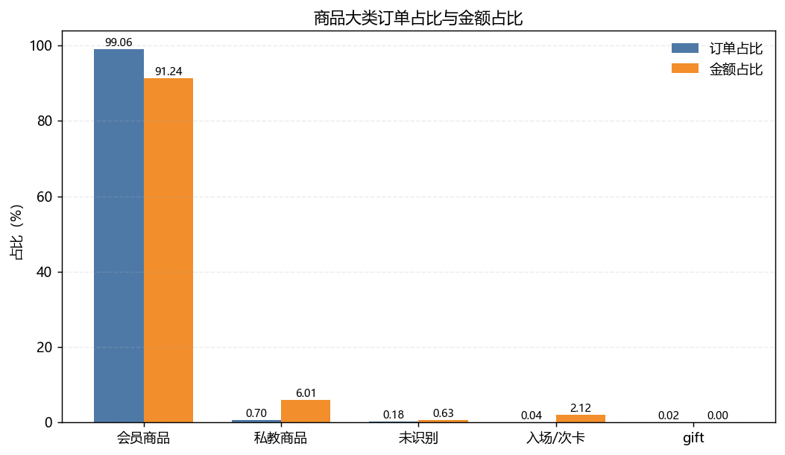

图 1 商品大类订单占比与金额占比。会员商品在订单数量中占据绝对主体，私教商品订单占比较低但平均金额较高，说明会员续费和私教购买具有不同的消费结构特征，需要分别建模。

### 3.3 用户行为特征

本文构造线下活跃度、线上互动强度、消费结构、流失风险和私教课包状态等特征。

线下活跃度定义为：

$$
A_{i,t}=u_1\widetilde{F}_{i,t}+u_2\widetilde{T}_{i,t}+u_3\widetilde{C}^{cal}_{i,t}+u_4\widetilde{D}^{run}_{i,t}+u_5\widetilde{Q}_{i,t},
\tag{1}
$$

其中 $F_{i,t}$ 表示到店次数，$T_{i,t}$ 表示在馆时长，$C_{i,t}^{cal}$ 表示运动消耗，$D_{i,t}^{run}$ 表示跑步距离，$Q_{i,t}$ 表示无氧训练量，波浪线表示标准化后的变量，$u_1,\ldots,u_5$ 表示各标准化运动变量的综合权重。

线上互动强度定义为：

$$
S_{i,t}=a_1Post_{i,t}+a_2Like_{i,t}+a_3Comment_{i,t}+a_4Liked_{i,t}+a_5Commented_{i,t}.
\tag{2}
$$

近因-粘性状态向量采用购买粘性和行为近因得分的组合：

$$
L_{i,t}=\left(Stickiness_i,VisitRecency_i,ActiveRecency_i,InteractRecency_i\right),
\tag{3}
$$

其中：

$$
Stickiness_i=\frac{\log(1+PTAmountTotalBefore_i)}{DaysSinceLastBuy_i+1},
\tag{4}
$$

$$
VisitRecency_i=\frac{1}{DaysSinceLastVisit_i+1},\quad
ActiveRecency_i=\frac{1}{DaysSinceLastActive_i+1},\quad
InteractRecency_i=\frac{1}{DaysSinceLastInteract_i+1}.
\tag{5}
$$

### 3.4 用户状态划分与状态转移

根据用户活跃度、消费水平、私教潜力和流失风险，将用户划分为若干运营状态。受真实数据稀疏性影响，实际识别出的核心状态主要集中在高活跃高消费用户、私教潜在用户和流失风险用户。

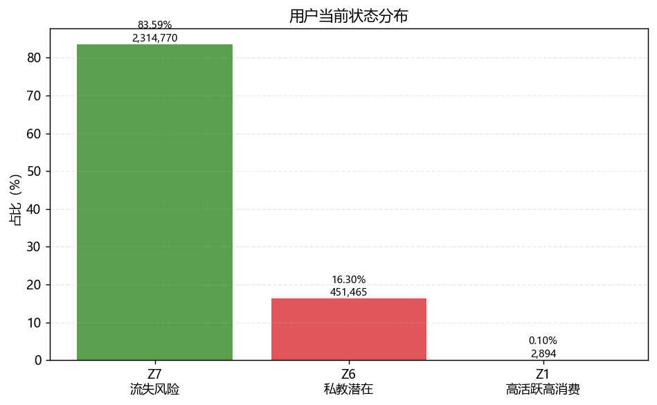

图 2 用户当前状态分布。流失风险用户占比最高，私教潜在用户次之，高活跃高消费用户占比较低，说明平台用户自然状态中存在明显的低活跃惯性。

设 $Z_{i,t}$ 表示用户 $i$ 在窗口 $t$ 的状态，则自然状态转移概率定义为：

$$
P_{ab}^{0}=P(Z_{i,t+1}=b|Z_{i,t}=a).
\tag{6}
$$

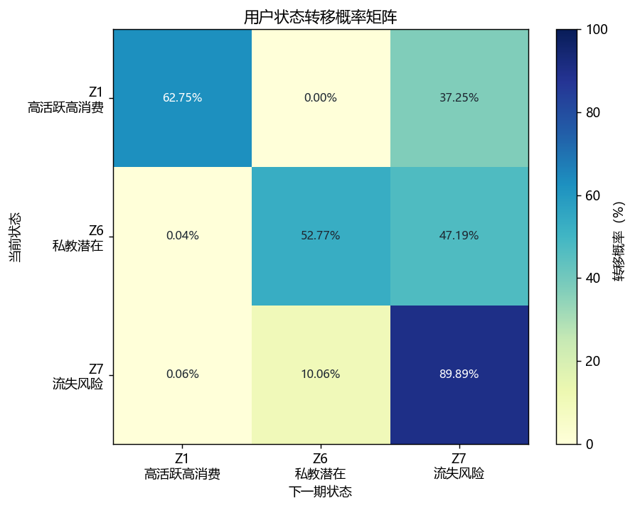

图 3 用户状态转移概率热力图。流失风险用户保持流失风险状态的概率较高，私教潜在用户也存在较高比例转向流失风险状态，说明若缺少有效激励，用户自然恢复到高活跃状态的概率较低，因此有必要设计分层积分策略。

---

## 4 模型建立

### 4.1 会员续费模型

本文关注用户在会员到期后 $H$ 天内是否续费。设 $T_i$ 为用户 $i$ 从本次会员权益结束到下一次会员购买之间的等待时间，$X_i^{renew}$ 为续费预测模型使用的特征向量，则续费概率建模目标为：

$$
P(T_i\leq H|X_i^{renew}).
\tag{7}
$$

续费标签定义为：

$$
Y_i^{renew,H}=
\begin{cases}
1, & NextBuyDate_i-EndDate_i\leq H,\\
0, & C_{obs}-EndDate_i\geq H \text{ 且 } (NextBuyDate_i-EndDate_i>H \text{ 或未观察到下一次会员购买}),\\
\text{censored}, & C_{obs}-EndDate_i<H \text{ 且未观察到续费}.
\end{cases}
\tag{8}
$$

其中 $NextBuyDate_i$ 表示用户下一次会员商品购买日期，$EndDate_i$ 表示本次会员权益结束日期，$C_{obs}$ 表示数据截止观察日期。二分类模型只使用 $Y_i^{renew,H}\in\{0,1\}$ 的完整观察样本；右删失样本保留给 Cox 生存模型。

Cox 生存模型用于处理右删失样本并解释变量对续费风险率的影响：

$$
h_i(t)=h_0(t)\exp(\beta^\top X_i).
\tag{9}
$$

模型输出的 $H$ 天内续费概率为：

$$
\hat p_{i,cox}^{renew,H}=1-S_i(H).
\tag{10}
$$

其中 $h_0(t)$ 为基准风险函数，$\beta$ 为解释变量系数，$X_i$ 为 Cox 模型使用的续费解释变量，$S_i(H)$ 为用户 $i$ 在 $H$ 天时点仍未续费的生存概率。Cox 模型主要用于说明右删失处理和续费等待时间结构，不作为策略模拟的主要概率输入。

为提高预测能力并检验模型稳健性，本文进一步构建 Logistic-GAM、普通随机森林和状态增强随机森林。Logistic-GAM 在 Logistic 回归基础上加入部分连续变量的非线性平滑函数，设 $\eta_i$ 为线性预测项，则：

$$
\eta_i=\beta_0+\sum_{l=1}^{L}f_l(x_{il})+\sum_{m=1}^{M}\beta_m z_{im},
\tag{11}
$$

$$
\hat p_{i,gam}^{renew,H}=\frac{1}{1+\exp(-\eta_i)}.
\tag{12}
$$

其中 $f_l(\cdot)$ 表示连续变量 $x_{il}$ 的平滑函数，$z_{im}$ 表示不进入平滑项的普通解释变量，$\beta_m$ 为对应系数。

普通随机森林使用基础特征向量 $X_i^{base}$。本文中，$X_i^{base}$ 由会员权益特征、线下活跃特征、线上互动特征、消费与私教历史特征组成，可记为 $X_i^{base}=(X_i^{member},X_i^{act},X_i^{int},X_i^{pay},X_i^{pt\_his})$。其中，$X_i^{member}$ 表示会员类型、剩余会员天数和会员价格等权益特征；$X_i^{act}$ 表示到店、在馆、跑步、消耗和无氧训练等线下活跃特征；$X_i^{int}$ 表示发帖、点赞、评论等线上互动特征；$X_i^{pay}$ 表示订单金额、订单次数、客单价等消费特征；$X_i^{pt\_his}$ 表示私教历史购买和私教课时特征。距上次到店、距上次活跃、距上次互动等原始日历天数字段只作为工程源变量，用于构造后续近因状态得分，不直接进入本文最终采用的 SERF 特征向量。

普通随机森林由 $B$ 棵分类树组成。设第 $b$ 棵树对用户 $i$ 输出的续费概率为 $T_b(X_i^{base})$，则随机森林预测概率为：

$$
\hat p_{i,rf}^{renew,H}=\frac{1}{B}\sum_{b=1}^{B}T_b(X_i^{base}).
\tag{13}
$$

状态增强随机森林记为 SERF（State-Enhanced Random Forest）。其核心思想是在普通行为消费特征 $X_i^{base}$ 的基础上，引入用户状态、活跃提升空间、线上线下联动和综合流失风险向量等状态增强特征，形成：

$$
X_i^{serf}=\left(X_i^{base},Z_i,Gap_i^{A},O2O_i,L_i\right),
\tag{14}
$$

$$
Gap_i^{A}=\max(A^{target}-A_{i,t},0),\quad O2O_i=A_{i,t}\ln(1+S_{i,t}).
\tag{15}
$$

其中 $Z_i$ 表示用户当前运营状态，$Gap_i^{A}$ 表示用户距离目标活跃水平的提升空间，$O2O_i$ 表示线上线下联动强度，$L_i$ 表示由购买粘性和行为近因得分构成的近因-粘性状态向量。需要说明的是，$L_i$ 不是直接把“距上次到店天数、距上次活跃天数、距上次互动天数”逐项作为策略响应变量，而是将这些难以直接量化 $\Delta A$ 影响的历史近因信息转化为状态得分后统一纳入 SERF。策略模拟中，积分通过 $\kappa$ 语义更新作用于 $L_i$，而不在正文中解释为真实日历天数被积分直接改写。SERF 的预测概率为：

$$
\hat p_{i,serf}^{renew,H}=\frac{1}{B}\sum_{b=1}^{B}T_b(X_i^{serf}).
\tag{16}
$$

会员续费模型使用的主要输入特征组如下。

表 1 会员续费模型输入特征组说明。

| 特征组 | 代表变量 | 含义 | 用途 |
|---|---|---|---|
| 会员权益特征 | 当前会员类型、剩余会员天数、会员价格 | 描述会员商品和权益周期 | 构造续费标签和预测续费概率 |
| 线下活跃特征 | 到店次数、在馆时长、跑步距离、运动消耗、无氧训练量、$A_{i,t}$ | 描述用户线下锻炼强度 | 反映运动习惯和可提升空间 |
| 线上互动特征 | 发帖、点赞、评论、被点赞、被评论、$S_{i,t}$ | 描述社区互动水平 | 刻画线上参与度 |
| 消费与私教历史 | 订单金额、订单次数、私教金额、私教课时 | 描述历史付费能力 | 预测续费意愿并衔接私教模型 |
| 用户状态特征 | $Z_i$、$Gap_i^A$、$O2O_i$ | 描述用户运营分层和提升空间 | 构成 SERF 状态增强特征 |
| 近因-粘性状态特征 | $L_i=(Stickiness_i,VisitRecency_i,ActiveRecency_i,InteractRecency_i)$ | 将购买粘性和行为近因压缩为状态得分向量 | 避免直接用最近天数解释积分响应，作为 SERF 状态增强输入 |

### 4.2 私教购买模型

私教购买是极低频事件，本文将其与会员续费分开建模。设 $Y_{i,t}^{pt}$ 表示用户 $i$ 在预测窗口内是否购买私教商品，标签定义为：

$$
Y_{i,t}^{pt}=
\begin{cases}
1, & \text{用户在预测窗口内购买私教商品},\\
0, & \text{否则}.
\end{cases}
\tag{17}
$$

私教购买预测使用增强特征向量 $X_i^{pt}$。该向量由基础行为消费特征和私教相关工程特征组成：

$$
X_i^{pt}=\left(X_i^{act},X_i^{int},X_i^{pay},X_i^{pt\_his},X_i^{rec},X_i^{state},X_i^{price}\right),
\tag{18}
$$

其中 $X_i^{act}$ 为线下活跃和运动特征，$X_i^{int}$ 为线上互动特征，$X_i^{pay}$ 为消费结构特征，$X_i^{pt\_his}$ 为历史私教购买特征，$X_i^{rec}$ 为近因-粘性工程状态特征，$X_i^{state}$ 为用户状态和会员到期状态，$X_i^{price}$ 为私教价格估计特征。这里的 $X_i^{rec}$ 不直接使用“距上次到店天数、距上次活跃天数、距上次互动天数、距上次私教购买天数”等原始日历天数字段，而是使用由其变换得到的到店近因得分、活跃近因得分、私教购买近因得分和购买粘性得分等紧凑状态变量。

考虑到私教购买正样本极少，本文采用 case-control 抽样训练部分模型。设真实训练集正样本比例为 $\pi$，case-control 抽样后的训练正样本比例为 $\pi_s$，模型在抽样分布下输出的概率为 $\hat p_i^{s}$，则先验校正后的真实分布概率为：

$$
odds_i=\frac{\hat p_i^{s}}{1-\hat p_i^{s}}\cdot
\frac{\pi/(1-\pi)}{\pi_s/(1-\pi_s)},
\tag{19}
$$

$$
\hat p_i^{pt}=\frac{odds_i}{1+odds_i}.
\tag{20}
$$

其中 $odds_i$ 为校正后的购买几率。若模型直接在全量样本上训练，则不需要式（19）的先验校正。

本文比较增强随机森林、CaseControl-ExtraTrees 和 CaseControl-HistGBDT。HistGBDT 表示直方图梯度提升决策树，其加性模型形式可写为：

$$
F_M(X_i^{pt})=\sum_{m=1}^{M}\nu f_m(X_i^{pt}),
\tag{21}
$$

$$
\hat p_i^{s}=\frac{1}{1+\exp[-F_M(X_i^{pt})]}.
\tag{22}
$$

其中 $f_m(\cdot)$ 为第 $m$ 棵回归树，$\nu$ 为学习率，$M$ 为树的数量。增强私教购买模型在策略模拟阶段接收更新后的反事实特征，并输出策略后的私教购买概率。

### 4.3 积分响应函数

由于历史数据中没有真实积分干预记录，本文不直接估计积分对行为和消费的因果效应，而是构造边际递减的积分响应函数。所谓边际递减，是指积分越多，用户活跃度提升越大，但单位新增积分带来的额外提升逐渐降低。策略 $r_j$ 下用户获得的积分由线下锻炼积分、线上互动积分、分层附加奖励和积分上限共同决定：

$$
Point_{i,t}(r_j)=\min(p_0N_{i,t}^{eff}+p_1I_{i,t}^{eff}+B_{i,t},P_{\max}).
\tag{23}
$$

其中 $N_{i,t}^{eff}$ 表示用户有效线下锻炼次数，$I_{i,t}^{eff}$ 表示有效线上互动次数，$B_{i,t}$ 表示用户状态附加积分，$p_0$、$p_1$ 和 $P_{\max}$ 分别为线下积分系数、线上积分系数和积分上限。

用户 $i$ 属于用户组 $g$ 时，积分带来的窗口 1 活跃提升定义为：

$$
\Delta A_{ig,1}(r_j)=\alpha_{g,j}\left(1-e^{-\beta_{g,j} Point_{i,t}(r_j)}\right).
\tag{24}
$$

其中 $\alpha_{g,j}$ 表示用户组 $g$ 在策略 $r_j$ 下的最大可实现活跃提升空间，$\beta_{g,j}$ 表示用户组 $g$ 在策略 $r_j$ 下对积分的敏感度。二者由基础响应参数和策略强度共同确定：

$$
\alpha_{g,j}=s_j^\rho\max\{\rho_g(A^{target}-\bar A_g),\,2\rho_g\},
\tag{25}
$$

$$
\beta_{g,j}=s_j^q\left[-\frac{\ln(1-q_g)}{P_g^{ref}}\right].
\tag{26}
$$

其中 $A^{target}$ 为目标活跃水平，本文取高活跃用户样本的平均活跃度；$\bar A_g$ 为用户组 $g$ 的当前平均活跃水平；$\rho_g$ 为可实现提升比例；$q_g$ 为参考积分水平下的响应比例；$P_g^{ref}$ 为参考积分水平；$s_j^\rho$ 和 $s_j^q$ 分别为策略 $r_j$ 对响应强度和积分敏感度的缩放系数。式（25）中的 $2\rho_g$ 是活跃提升空间保底项，用于避免高活跃用户组因 $A^{target}-\bar A_g$ 过小而在模拟中完全无法响应积分。

在延期观察窗口中，积分成本不再新增，但窗口 1 形成的活跃提升可能部分延续。设 $\gamma_A$ 为活跃延续系数，第 $d$ 个延期窗口中的活跃提升为：

$$
\Delta A_{ig,d}(r_j)=\gamma_A^d\Delta A_{ig,1}(r_j),\quad d=1,2,\ldots,D.
\tag{27}
$$

此外，积分首先直接改变活跃度，但续费模型和私教模型还包含互动、无氧训练、近因等相关特征。为描述活跃提升对这些反事实特征的联动影响，本文引入 $\kappa$ 语义更新因子：

$$
\kappa_{i,d}(r_j)=1+\gamma_\kappa\ln\left(1+\frac{\Delta A_{ig,d}(r_j)}{A_{i,t}+\epsilon_\kappa}\right).
\tag{28}
$$

其中 $\gamma_\kappa$ 控制活跃提升向其他特征传导的强度，$\epsilon_\kappa$ 为平滑项。策略模拟首先令 $A_{i,d}^{new}=A_{i,t}+\Delta A_{ig,d}(r_j)$；对线上互动、运动量、无氧训练量和消费/私教历史强度等非负强度特征 $X_i^{+}$，采用 $X_{i,d}^{+,new}=\kappa_{i,d}(r_j)X_i^{+,0}$；对 SERF 中的近因-粘性状态向量 $L_i$，采用 $L_{i,d}^{new}=\kappa_{i,d}(r_j)L_i^0$ 表示活跃改善后购买粘性和行为近因状态得分的语义改善。这里更新的是状态得分向量，不解释为直接改写“距上次到店天数”等原始日历天数。由此得到的反事实特征被输入 SERF 和增强私教购买模型，重新预测续费概率和私教购买概率。

### 4.4 收入、成本与利润函数

策略 $r_j$ 下，会员收入和私教收入分别按预测概率的期望收入计算。设总观察窗口由窗口 1 和 $D$ 个延期窗口组成，窗口权重分别为 $w_1$ 和 $w_d$。会员收入为：

$$
R_m(r_j)=w_1\sum_i \hat p_{i,1}^{renew,new}(r_j)Price_{m,i}
+\sum_{d=1}^{D}w_d\sum_i \hat p_{i,d}^{renew,new}(r_j)Price_{m,i}.
\tag{29}
$$

私教收入为：

$$
R_p(r_j)=w_1\sum_i \hat p_{i,1}^{pt,new}(r_j)Price_{p,i}
+\sum_{d=1}^{D}w_d\sum_i \hat p_{i,d}^{pt,new}(r_j)Price_{p,i}.
\tag{30}
$$

其中 $\hat p_{i,k}^{renew,new}(r_j)$ 和 $\hat p_{i,k}^{pt,new}(r_j)$ 分别表示策略 $r_j$ 下用户 $i$ 在第 $k$ 个窗口的续费概率和私教购买概率。

$Price_{m,i}$ 和 $Price_{p,i}$ 分别为用户 $i$ 的预计会员价格和预计私教价格。会员价格优先取用户当前会员商品价格，缺失时使用有效会员价格中位数补充；私教价格优先取用户历史私教单价估计，缺失或非正时使用真实私教购买正样本的平均成交金额补充。为避免异常非正价格影响收入计算，两个价格均设置为不低于 1：

$$
Price_{m,i}=
\begin{cases}
\max(CurrentMemberPrice_i,1), & CurrentMemberPrice_i>0,\\
\max(Median(CurrentMemberPrice),1), & \text{否则},
\end{cases}
\tag{31}
$$

$$
Price_{p,i}=
\begin{cases}
\max(PTUnitPriceEst_i,1), & PTUnitPriceEst_i>0,\\
\max(Mean(PTAmountNext_i|Y_i^{pt}=1),1), & \text{否则}.
\end{cases}
\tag{32}
$$

设 $c$ 为单位积分抵扣金额，$\tau$ 为单用户积分抵扣成本上限比例，$RedeemProb(r_j)$ 为策略 $r_j$ 的积分兑换概率，则窗口 1 的积分成本为：

$$
C_{point}(r_j)=\sum_i \min\left[c\cdot Point_{i,t}(r_j)\cdot RedeemProb(r_j),
\tau w_1\left(\hat p_{i,1}^{renew,new}Price_{m,i}+\hat p_{i,1}^{pt,new}Price_{p,i}\right)\right].
\tag{33}
$$

本文取会员收入毛利率为 0.35，私教收入毛利率为 0.30，平台利润函数为：

$$
\Pi(r_j)=0.35R_m(r_j)+0.30R_p(r_j)-C_{point}(r_j).
\tag{34}
$$

成本收入比定义为：

$$
CostRate(r_j)=\frac{C_{point}(r_j)}{R_m(r_j)+R_p(r_j)}.
\tag{35}
$$

候选策略需满足利润非负和成本收入比约束：

$$
\Pi(r_j)\geq0,\quad C_{point}(r_j)\leq\eta(R_m(r_j)+R_p(r_j)).
\tag{36}
$$

### 4.5 熵权-TOPSIS 综合评价

本文在可行策略集合中使用熵权-TOPSIS 进行综合评价。TOPSIS（Technique for Order Preference by Similarity to Ideal Solution）通过比较各策略与正理想解、负理想解之间的距离进行排序；熵权法根据指标离散程度确定权重。

首先筛选可行策略集合：

$$
\mathcal{R}'=\left\{r_j:\Pi(r_j)\geq0,\ CostRate(r_j)\leq\eta\right\}.
\tag{37}
$$

主评价指标包括：

- 正向指标：平台利润、总活跃度提升、最终续费概率提升、最终私教购买概率提升；
- 负向指标：积分成本、成本收入比。

设可行策略 $r_i$ 在指标 $k$ 上的原始值为 $x_{ik}$，标准化值为 $z_{ik}$。对正向指标有：

$$
z_{ik}=\frac{x_{ik}-\min_i x_{ik}}{\max_i x_{ik}-\min_i x_{ik}},
\tag{38}
$$

对负向指标有：

$$
z_{ik}=\frac{\max_i x_{ik}-x_{ik}}{\max_i x_{ik}-\min_i x_{ik}}.
\tag{39}
$$

若某一指标的极差为 0，则该指标在当前可行策略集合中不提供区分信息，标准化时按常数项处理。为避免标准化后出现零值导致熵值计算中的 $\ln 0$，设 $\varepsilon$ 为极小正数，令 $z_{ik}^{\varepsilon}=z_{ik}+\varepsilon$。熵权法先计算指标占比：

$$
p_{ik}=\frac{z_{ik}^{\varepsilon}}{\sum_i z_{ik}^{\varepsilon}},
\tag{40}
$$

再计算第 $k$ 个指标的信息熵和差异系数：

$$
e_k=-\frac{1}{\ln n}\sum_{i=1}^{n}p_{ik}\ln p_{ik},\quad d_k=1-e_k,
\tag{41}
$$

得到指标权重：

$$
w_k=\frac{d_k}{\sum_{k=1}^{K}d_k}.
\tag{42}
$$

加权标准化矩阵为：

$$
v_{ik}=w_kz_{ik}.
\tag{43}
$$

正理想解和负理想解分别定义为：

$$
v_k^+=\max_i v_{ik},\quad v_k^-=\min_i v_{ik}.
\tag{44}
$$

策略 $r_i$ 到正理想解和负理想解的距离为：

$$
D_i^+=\sqrt{\sum_{k=1}^{K}(v_{ik}-v_k^+)^2},\quad
D_i^-=\sqrt{\sum_{k=1}^{K}(v_{ik}-v_k^-)^2}.
\tag{45}
$$

TOPSIS 综合得分为：

$$
C_i=\frac{D_i^-}{D_i^+ + D_i^-}.
\tag{46}
$$

$C_i$ 越大，说明策略越接近正理想解，综合评价越优。为检验策略排序是否依赖私教概率人数提升这一指标，本文还进行替代指标稳健性分析。原指标方案和替代指标方案分别为：

$$
\mathcal{I}_0=\{\Pi,\Delta A,\Delta Renew,\Delta PT,C_{point},CostRate\},
\tag{47}
$$

$$
\mathcal{I}_1=\{\Pi,\Delta A,\Delta Renew,\Delta R_p,C_{point},CostRate\}.
\tag{48}
$$

其中 $\Delta PT$ 表示最终私教购买概率提升，$\Delta R_p$ 表示私教收入提升。两组指标中，$\Pi$、$\Delta A$、$\Delta Renew$、$\Delta PT$ 和 $\Delta R_p$ 为正向指标，$C_{point}$ 和 $CostRate$ 为负向指标。

为将多延期窗口纳入统一评价框架，设 $\Omega=\{(\gamma_A,D):\gamma_A\in\Gamma_A,\ D\in\mathcal{D}\}$ 表示延期观察情景集合，其中 $\Gamma_A$ 为活跃延续系数取值集合，$\mathcal{D}$ 为延期窗口数集合。对任一情景 $\omega=(\gamma_A,D)$，先按第 4.3 节和第 4.4 节计算多窗口累计收入、成本、利润及各项提升指标，再按式（37）至式（46）得到策略 $r_j$ 的情景 TOPSIS 得分：

$$
C_j(\omega)=TOPSIS\left(r_j;\gamma_A,D,\mathcal{I}\right).
\tag{49}
$$

其中 $\mathcal{I}$ 可取主指标方案 $\mathcal{I}_0$ 或替代指标方案 $\mathcal{I}_1$。策略 $r_j$ 在多延期窗口下成为最优策略的次数定义为：

$$
N_j=\sum_{\omega\in\Omega}\mathbf{1}\left\{C_j(\omega)=\max_{r_l\in\mathcal{R}'(\omega)}C_l(\omega)\right\},
\tag{50}
$$

其中 $\mathcal{R}'(\omega)$ 表示情景 $\omega$ 下满足经营约束的可行策略集合，$\mathbf{1}\{\cdot\}$ 为示性函数。若需要比较策略相对无积分基准策略的累计利润差，则定义：

$$
\Delta \Pi_j(\omega)=\Pi_j(\omega)-\Pi_0(\omega).
\tag{51}
$$

因此，本文的策略推荐并不只依据基准两窗口下的单次 TOPSIS 排名，还同时参考 $N_j$ 和 $\Delta \Pi_j(\omega)$ 在多延期窗口及参数扰动下的表现。

在具体计算 TOPSIS 指标时，多窗口活跃提升、续费概率提升、私教购买概率提升和私教收入提升分别定义为：

$$
\Delta A(r_j;\omega)=\sum_i\left[\Delta A_{ig,1}(r_j)+\sum_{d=1}^{D}\Delta A_{ig,d}(r_j)\right],
\tag{52}
$$

$$
\Delta Renew(r_j;\omega)=
w_1\sum_i\left(\hat p_{i,1}^{renew,new}(r_j)-\hat p_{i}^{renew,0}\right)
 + \sum_{d=1}^{D}w_d\sum_i\left(\hat p_{i,d}^{renew,new}(r_j)-\hat p_{i}^{renew,0}\right),
\tag{53}
$$

$$
\Delta PT(r_j;\omega)=
w_1\sum_i\left(\hat p_{i,1}^{pt,new}(r_j)-\hat p_{i}^{pt,0}\right)
 + \sum_{d=1}^{D}w_d\sum_i\left(\hat p_{i,d}^{pt,new}(r_j)-\hat p_{i}^{pt,0}\right),
\tag{54}
$$

$$
\Delta R_p(r_j;\omega)=R_p(r_j;\omega)-R_p(r_0;\omega).
\tag{55}
$$

其中 $\hat p_i^{renew,0}$ 和 $\hat p_i^{pt,0}$ 分别表示无积分基准策略下的续费概率和私教购买概率。式（52）至式（55）给出的四个提升量与平台利润、积分成本和成本收入比共同构成 TOPSIS 评价矩阵。

---

## 5 模型求解与结果分析

### 5.1 商品分类与状态转移结果

商品分类结果表明，会员商品在订单数量上占据绝对主体，私教商品订单占比较低但平均金额较高。这说明会员续费和私教购买属于两类不同性质的经营问题：会员续费具有较高频率和稳定权益周期，私教购买则具有低频、高金额和强用户差异的特点。

状态转移结果显示，流失风险用户具有较强状态惯性，私教潜在用户也存在较高比例转向流失风险状态。因此，积分策略不宜只面向全体用户平均发放，而应重点考虑用户分层和流失风险召回。

### 5.2 会员续费模型结果

H30 和 H60 续费样本均包含 561752 条记录。H30 续费事件率约为 53.23%，右删失比例约为 11.86%；H60 续费事件率约为 56.50%，右删失比例约为 14.57%。因此，本文采用 H30 作为主分析窗口，H60 作为稳健性窗口。

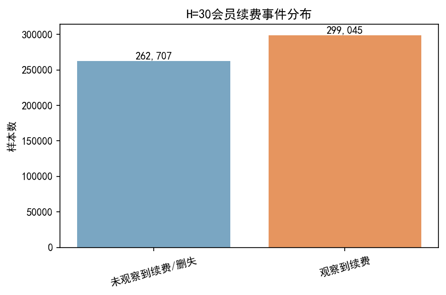

图 4 H30 续费事件分布。续费事件和未续费样本均具有足够规模，右删失比例处于可处理范围内，支持使用有限观察窗口下的生存分析和二分类预测模型。

Cox 生存模型用于解释续费等待时间和右删失处理。由于本文未进行 Schoenfeld 残差检验，因此 Cox 模型只作为生存分析解释和右删失处理依据，不写成“通过比例风险假设检验”。

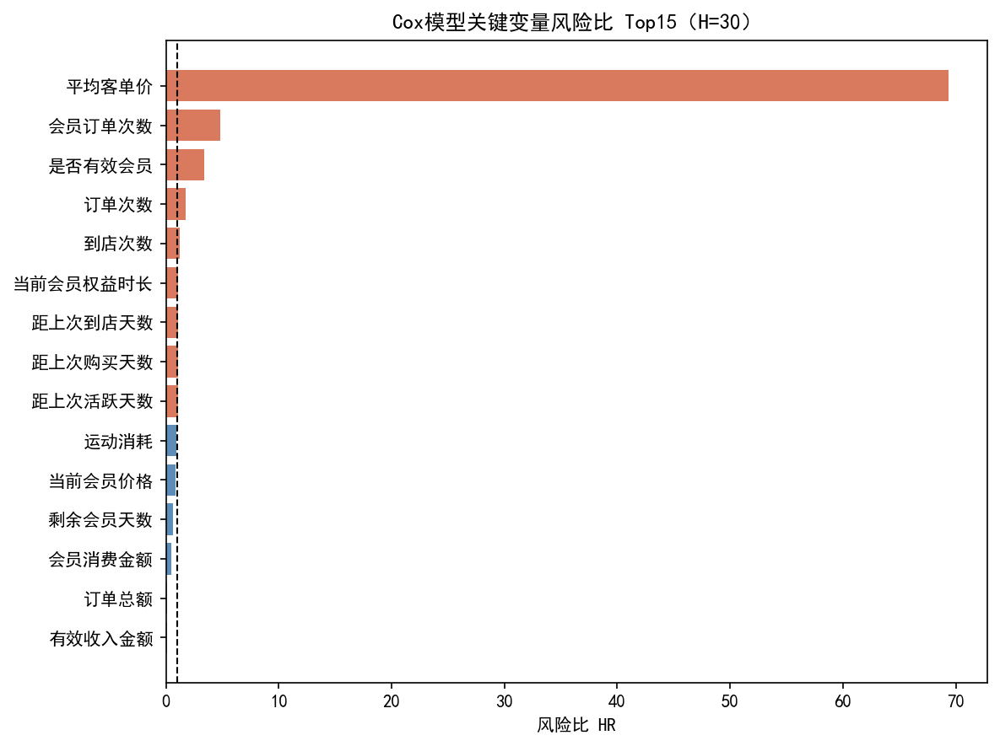

图 5 Cox 关键变量风险比 Top15。风险比用于解释变量对续费风险率的相对影响，但不作为后续积分策略模拟的主要概率输入。

在预测模型对比中，本文使用 AUC、F1、Recall、Precision 和 Brier Score 衡量模型表现。AUC 指 ROC 曲线下面积，用于衡量模型对正负样本的整体排序能力；F1 是 Precision 和 Recall 的调和平均数；Recall 表示正样本召回率；Precision 表示预测为正的样本中真实为正的比例；Brier Score 是概率预测均方误差，值越小表示概率校准越好。各模型在 H30 和 H60 两个窗口下的测试指标如表 2 所示。

表 2 会员续费模型预测指标对比。

| 窗口 | 模型 | 阈值 | AUC | F1 | Recall | Precision | Brier Score |
|---|---|---:|---:|---:|---:|---:|---:|
| H30 | 状态增强随机森林 SERF | 0.36 | 0.9701 | 0.8744 | 0.7883 | 0.9816 | 0.1305 |
| H30 | 普通随机森林 | 0.36 | 0.9759 | 0.9634 | 0.9404 | 0.9875 | 0.1184 |
| H30 | Logistic-GAM | 0.38 | 0.9088 | 0.7711 | 0.6358 | 0.9796 | 0.1968 |
| H30 | Cox 生存模型 | 0.33 | 0.7873 | 0.8741 | 0.9529 | 0.8074 | 0.1951 |
| H60 | 状态增强随机森林 SERF | 0.35 | 0.9640 | 0.9599 | 0.9301 | 0.9917 | 0.1361 |
| H60 | 普通随机森林 | 0.33 | 0.9679 | 0.9575 | 0.9267 | 0.9903 | 0.1251 |
| H60 | Logistic-GAM | 0.35 | 0.9125 | 0.7906 | 0.6592 | 0.9874 | 0.2008 |
| H60 | Cox 生存模型 | 0.36 | 0.8083 | 0.9216 | 0.9388 | 0.9050 | 0.1679 |

从表 2 可以看出，普通随机森林在纯预测指标上略优，状态增强随机森林与普通随机森林的 AUC 差距较小。H30 下，状态增强随机森林 AUC 为 0.9701，普通随机森林 AUC 为 0.9759；H60 下，状态增强随机森林 AUC 为 0.9640，普通随机森林 AUC 为 0.9679。状态增强随机森林虽然在 H30 的 F1 和 Brier Score 上低于普通随机森林，但它显式纳入 $Z_i,Gap_i^A,O2O_i,L_i$ 等运营解释特征，特征口径更贴合积分策略情景模拟。因此，本文将普通随机森林作为纯预测性能参照，将状态增强随机森林作为后续策略模拟中的续费概率输入。

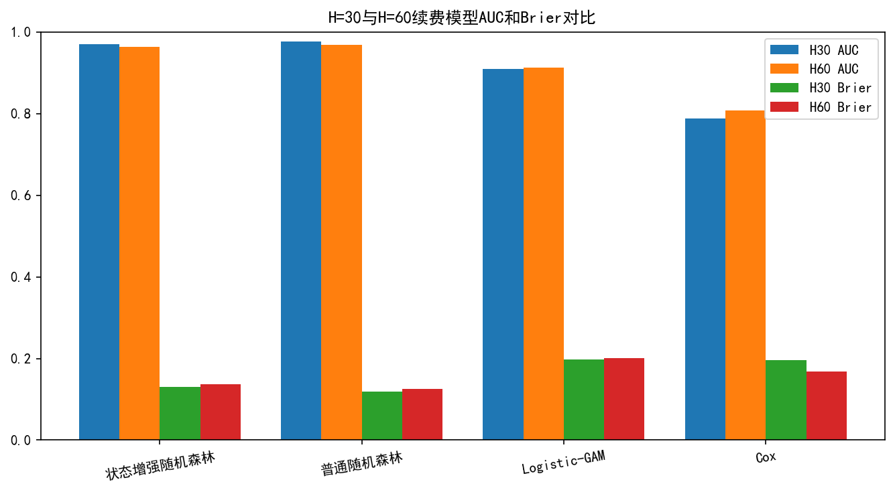

图 6 H30/H60 续费模型 AUC 与 Brier 对比。状态增强随机森林与普通随机森林在不同续费观察窗口下表现接近，说明续费概率预测不依赖单一观察窗口。

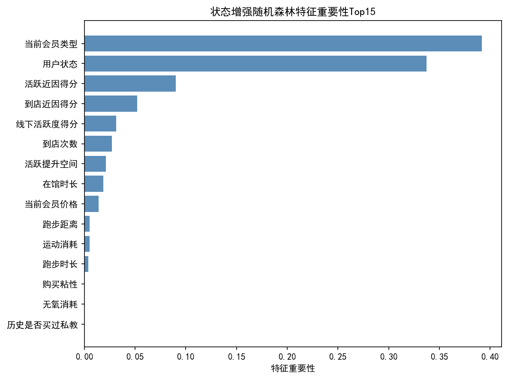

图 7 状态增强随机森林特征重要性 Top15。H30 特征重要性结果显示，当前会员类型的重要性为 0.3917，用户状态为 0.3375，活跃近因得分为 0.0902，到店近因得分为 0.0522，线下活跃度得分为 0.0316，活跃提升空间为 0.0215。可见，SERF 的主要预测贡献集中在会员权益、用户运营状态、近因-粘性状态和活跃提升空间上，较普通随机森林更便于解释“哪些用户状态适合被积分策略影响”。因此，即使 SERF 的纯预测指标略低于普通随机森林，本文仍选择 SERF 作为情景模拟中的续费预测模型。

### 5.3 私教购买模型结果

私教购买样本极度不平衡，训练集正样本比例约为 0.0825%，测试集正样本比例约为 0.0910%。因此，本文采用增强私教购买模型，并通过特征消融和 TopK 指标检查泛化能力。为避免术语歧义，表 3 给出本文私教购买模型中的特征集合和处理方式。

表 3 私教购买模型特征集合与处理方式。

| 名称 | 具体含义 | 主要变量或处理 |
|---|---|---|
| 基础行为特征 | 用户线下锻炼和到店行为 | 到店次数、在馆时长、跑步距离、跑步时长、运动消耗、线下活跃度 $A_{i,t}$ |
| 无氧训练特征 | 与力量训练相关的私教潜在需求 | 无氧训练次数、无氧训练量、无氧训练消耗、力量训练频率得分、力量训练量得分 |
| 线上互动特征 | 用户线上社区参与水平 | 发帖、点赞、评论、被点赞、被评论、线上互动强度 $S_{i,t}$ |
| 消费结构特征 | 用户历史付费能力和消费偏好 | 订单金额、订单次数、客单价、会员金额、私教金额、折扣订单比例、私教收入占比、会员收入占比 |
| 私教历史特征 | 用户过往私教购买和粘性 | 是否买过私教、历史私教金额、历史私教课时、私教购买近因得分、私教消费粘性、私教课时粘性 |
| 会员状态特征 | 用户当前会员权益状态 | 当前会员类型、剩余会员天数、是否临近 30 天到期、是否临近 60 天到期、是否已过期 |
| 用户状态特征 | 前文划分的运营状态 | 高活跃高消费用户、私教潜在用户、流失风险用户等状态变量 |
| 价格估计特征 | 私教收入测算所需价格 | 私教单价估计、后续私教购买金额；缺失价格用正样本平均成交金额补充 |
| 核心精简特征 | 用于过拟合风险对照的较小特征集 | 保留活跃、消费、私教历史、近因状态得分、会员状态等 30 个稳定变量 |
| 全量增强特征 | 最终候选模型使用的完整特征集 | 在核心精简特征外加入跑步、线上互动、消费结构、到期状态和线上线下联动等变量，共 57 个变量 |
| Case-control 抽样 | 稀有正样本处理 | 保留全部正样本并抽取部分负样本，提高训练集正样本比例，预测后按式（19）校正先验 |
| CaseControl-HistGBDT | 最终私教购买模型 | 使用 case-control 抽样训练的直方图梯度提升决策树，并进行先验校正 |

私教购买模型评价中，PR-AUC 表示 Precision-Recall 曲线下面积，适合评价极低频正样本场景；ROC-AUC 表示 ROC 曲线下面积；Brier Score 衡量概率校准误差；TopK Precision 表示预测概率最高的前 $K$ 个用户中真实购买私教的比例；TopK Recall 表示前 $K$ 个用户覆盖真实私教购买样本的比例；Lift@K 表示 TopK Precision 相对于总体正样本比例的提升倍数。当前最佳模型为“全量增强特征 + CaseControl-HistGBDT”，测试集 PR-AUC 为 0.2399，ROC-AUC 为 0.8711，Brier Score 为 0.000769，F1 为 0.3385。

表 4 私教购买增强模型主要预测指标对比。

| 特征集 | 模型 | 训练方式 | 特征数 | PR-AUC | ROC-AUC | Brier | F1 | Recall | Precision | 是否先验校正 |
|---|---|---|---:|---:|---:|---:|---:|---:|---:|---|
| 全量增强特征 | CaseControl-HistGBDT | case-control | 57 | 0.2399 | 0.8711 | 0.000769 | 0.3385 | 0.2620 | 0.4781 | 是 |
| 核心精简特征 | CaseControl-HistGBDT | case-control | 30 | 0.2383 | 0.8689 | 0.000762 | 0.3380 | 0.2620 | 0.4762 | 是 |
| 核心精简特征 | CaseControl-ExtraTrees | case-control | 30 | 0.2328 | 0.8244 | 0.002106 | 0.3298 | 0.2358 | 0.5482 | 是 |
| 全量增强特征 | 增强随机森林 | 全量样本 | 57 | 0.2326 | 0.8308 | 0.061131 | 0.3363 | 0.2511 | 0.5088 | 否 |
| 全量增强特征 | CaseControl-ExtraTrees | case-control | 57 | 0.2296 | 0.8346 | 0.001977 | 0.3302 | 0.2314 | 0.5761 | 是 |
| 核心精简特征 | 增强随机森林 | 全量样本 | 30 | 0.2261 | 0.8518 | 0.068313 | 0.3404 | 0.2445 | 0.5600 | 否 |

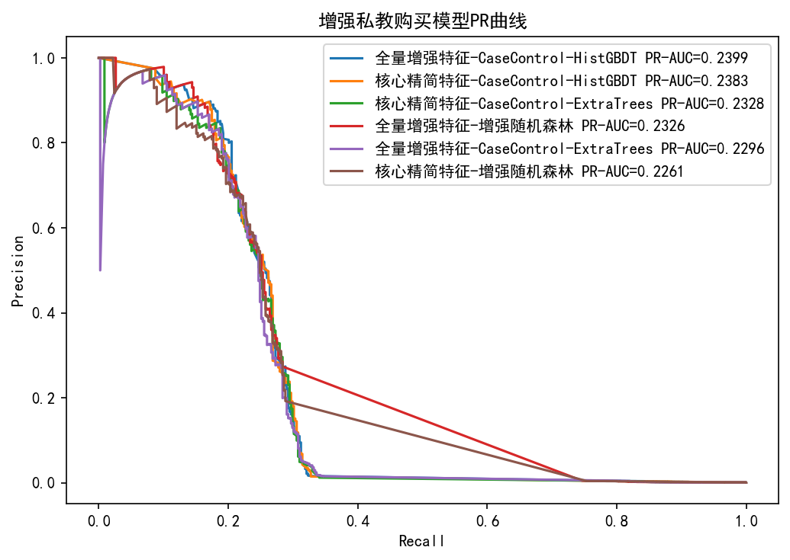

图 8 增强私教购买模型 PR 曲线。由于私教购买属于极低频事件，PR 曲线比 Accuracy 更能反映模型对正样本的识别能力。

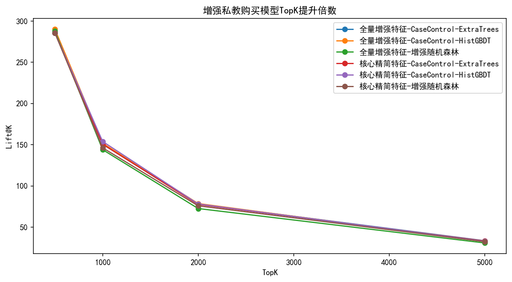

图 9 增强私教购买模型 TopK Lift。图中横轴为不同 $K$ 取值，展示模型在高分用户集合中的 Lift 变化；随着 $K$ 增大，Precision@K 和 Lift@K 下降，但 Recall@K 上升，符合稀有事件排序模型的一般规律。

表 5 最佳私教购买模型 TopK 排序结果。

| K | 命中正样本数 | Precision@K | Recall@K | Lift@K |
|---:|---:|---:|---:|---:|
| 100 | 84 | 0.8400 | 0.1834 | 923.41 |
| 200 | 110 | 0.5500 | 0.2402 | 604.61 |
| 500 | 132 | 0.2640 | 0.2882 | 290.21 |
| 1000 | 138 | 0.1380 | 0.3013 | 151.70 |
| 2000 | 143 | 0.0715 | 0.3122 | 78.60 |
| 5000 | 147 | 0.0294 | 0.3210 | 32.32 |

由上述 TopK 排序结果可以看出，最佳模型在测试集 Top500 中命中 132 个正样本，Precision@500 为 0.264，Recall@500 为 0.2882，Lift@500 约为 290.21；当 $K$ 扩展到 1000、2000 和 5000 时，模型仍能保持明显高于总体正样本比例的命中能力。因此，该模型更适合用于高潜私教购买用户排序，而不是直接按单一阈值解释所有用户的购买行为。

增强私教购买模型已导出并接入策略模拟。策略模拟中，积分先改变活跃、无氧、互动和近因等反事实特征，再重新调用增强私教购买模型得到策略后的私教购买概率。由于 case-control 训练改变了样本先验，策略模拟阶段对模型输出概率进行了先验校正。

### 5.4 候选积分策略设置

本文设置六个候选策略：

表 6 候选积分策略说明。

| 策略编号 | 策略名称 | 策略含义 |
|---|---|---|
| S0 | 无积分基准策略 | 不发放积分，作为收益和行为提升的对照基准 |
| S1 | 低补贴保留策略 | 低积分强度，强调成本控制和利润保持 |
| S2 | 均衡促活策略 | 中等积分强度，兼顾促活和成本 |
| S3 | 私教转化强化策略 | 面向私教潜在用户提高私教转化激励 |
| S4 | 流失召回强化策略 | 面向流失风险用户提高召回激励 |
| S5 | 高强度综合激励策略 | 高积分强度，追求更强促活和长期转化 |

表 7 候选积分策略参数设置。

| 策略编号 | $p_0$ | $p_1$ | $B_{Z1}$ | $B_{Z6}$ | $B_{Z7}$ | $P_{\max}$ | $RedeemProb$ | $\rho$ 缩放 | $q$ 缩放 |
|---|---:|---:|---:|---:|---:|---:|---:|---:|---:|
| S0 | 0 | 0 | 0 | 0 | 0 | 0 | 0.00 | 0.00 | 0.00 |
| S1 | 6 | 2 | 20 | 10 | 10 | 120 | 0.30 | 0.80 | 0.80 |
| S2 | 10 | 4 | 20 | 40 | 50 | 220 | 0.50 | 1.00 | 1.00 |
| S3 | 9 | 4 | 10 | 90 | 35 | 260 | 0.55 | 1.10 | 1.10 |
| S4 | 12 | 5 | 10 | 40 | 110 | 300 | 0.60 | 1.20 | 1.20 |
| S5 | 16 | 7 | 40 | 100 | 130 | 420 | 0.70 | 1.50 | 1.50 |

表中 $B_{Z1}$、$B_{Z6}$ 和 $B_{Z7}$ 分别表示高活跃高消费用户、私教潜在用户和流失风险用户的状态附加积分。$\rho$ 缩放和 $q$ 缩放用于在基准用户组响应参数基础上调整式（25）和式（26）中的响应强度和参考响应比例。

表 8 用户组积分响应基准参数设置。

| 用户组 | $\rho_g$ | $q_g$ | $P_g^{ref}$ | 参数含义 |
|---|---:|---:|---:|---|
| Z1 高活跃高消费用户 | 0.25 | 0.18 | 160 | 已较活跃，最大提升空间较小，维持型激励为主 |
| Z6 私教潜在用户 | 0.45 | 0.28 | 220 | 私教转化潜力较高，对积分响应相对更强 |
| Z7 流失风险用户 | 0.35 | 0.22 | 240 | 需要召回激励，但响应存在不确定性 |
| 其他用户 | 0.30 | 0.20 | 200 | 用于未归入核心状态用户的平均响应假设 |

表中 $\rho_g$ 用于确定式（25）中的最大可实现活跃提升空间，$q_g$ 和 $P_g^{ref}$ 用于确定式（26）中的积分敏感度。候选策略表中的 $\rho$ 缩放和 $q$ 缩放分别作用于对应用户组的 $\rho_g$ 和 $q_g$，用于表达不同策略强度下的响应差异。

### 5.5 候选积分策略模拟结果

本节在第 4 章模型基础上，对六类候选积分策略进行情景模拟。模拟分为基准两窗口和多延期窗口两类。基准两窗口采用“积分实施窗口 + 1 个延期观察窗口”的结构；多延期窗口进一步改变延期窗口数量和活跃延续系数，用于观察策略收益是否会随观察期延长而发生变化。窗口 1 为积分机制实施期，计入积分发放和兑换成本；延期窗口不再新增积分成本，但保留窗口 1 形成的部分活跃提升惯性，并据此重新构造 SERF 续费模型和增强私教购买模型所需的反事实特征。收入、成本和利润均按第 4.4 节式（29）至式（36）计算，TOPSIS 排名按第 4.5 节式（37）至式（51）计算。

表 9 策略模拟全局参数与多延期窗口设置。

| 参数 | 取值 | 含义 | 对应公式或用途 |
|---|---:|---|---|
| $H$ | 30 天 | 主分析续费观察窗口 | 续费标签和 SERF 概率输入 |
| $c$ | 0.01 | 单位积分抵扣金额 | 式（33） |
| $\tau$ | 0.30 | 单用户积分抵扣成本上限比例 | 式（33） |
| $\eta$ | 0.18 | 平台可接受的成本收入比上限 | 式（36）（37） |
| $w_1$ | 1.00 | 积分实施窗口收入权重 | 式（29）（30） |
| $w_d$ | 1.00 | 每个延期窗口收入权重 | 式（29）（30） |
| $\Gamma_A$ | $\{0.20,0.35,0.50,0.70\}$ | 活跃延续系数集合 | 式（27）（49） |
| $\mathcal{D}$ | $\{1,2,3,4,6,8,12\}$ | 延期窗口数集合 | 式（27）（49） |
| 基准情景 | $\gamma_A=0.35,\ D=1$ | 基准两窗口，即 L2 情景 | 表 11 的排序结果 |
| $\gamma_\kappa$ | $\{0.25,0.50,0.75,1.00\}$ | 语义更新放大强度测试值 | 式（28） |
| $\epsilon_\kappa$ | $\{10^{-9},10^{-4},10^{-3},10^{-2},5\times10^{-2}\}$ | 语义更新平滑项测试值 | 式（28） |

其中，本文将 $\gamma_A=0.20,0.35,0.50,0.70$ 的四类延期观察情景分别记为 L1、L2、L3 和 L4。基准两窗口结果采用 L2 且 $D=1$，即活跃延续系数取 0.35，并额外观察 1 个延期窗口。

策略模拟中，会员续费概率由 H30 状态增强随机森林，即 SERF（State-Enhanced Random Forest）工件在线推理得到。SERF 指在普通随机森林续费模型基础上加入用户状态、活跃提升空间、线上线下联动强度和近因-粘性状态向量 $L_i$ 等状态增强特征的随机森林模型。私教购买概率由增强私教购买模型在线推理得到。本文所称“全量增强特征 + CaseControl-HistGBDT”是指：使用包含用户活跃、运动、互动、消费、私教历史、行为近因和用户状态等全量增强特征，并采用 case-control 抽样训练的直方图梯度提升决策树模型（Histogram-based Gradient Boosting Decision Tree）。由于 case-control 抽样会改变训练样本中的正负样本先验，策略模拟阶段需根据真实先验和抽样先验对模型输出概率进行校正。

需要强调的是，策略后的续费概率和私教购买概率均不是人为设置的线性加成。积分策略首先通过边际递减响应函数改变用户活跃、无氧训练、互动和近因-粘性状态得分等反事实特征，再将更新后的特征输入 SERF 和增强私教购买模型重新预测。其中，$L_i$ 的变化是对活跃改善后用户状态语义的模拟，不解释为原始最近行为日期被直接改变。因此，概率变化属于“历史预测模型 + 积分响应假设”下的情景模拟结果，不能解释为真实积分干预因果效应。

第 5.4 节表 6、表 7 和表 8 给出了候选策略的业务含义、策略参数和用户组响应基准参数。S0 为无积分基准，用于计算利润差和概率提升；S1-S5 为不同补贴强度和目标人群的可行策略。

基准两窗口下，S5 的总活跃度提升、最终续费概率提升、最终私教购买概率提升和私教收入提升均较高，但积分成本也最高。S4 的平台利润高于 S5，积分成本和成本收入比低于 S5。S3 虽然面向私教转化，但其私教收入提升与 S2 接近，且平台利润低于 S2，因此不能作为综合最优策略。进一步地，在多延期窗口中，本文对 $\Gamma_A\times\mathcal{D}$ 共 28 个组合重复计算累计收入、利润差和 TOPSIS 排名，用于检验策略排序是否依赖单一观察期长度。表 10 给出主指标方案下多延期窗口的最优策略次数。

表 10 多延期窗口 TOPSIS 最优策略次数统计。

| 策略编号 | 策略名称 | 成为最优策略次数 | 占 28 个情景比例 |
|---|---|---:|---:|
| S5 | 高强度综合激励策略 | 22 | 78.57% |
| S4 | 流失召回强化策略 | 5 | 17.86% |
| S2 | 均衡促活策略 | 1 | 3.57% |

上述统计表明，在同时改变活跃延续系数和延期窗口数量时，S5 的长期综合竞争力明显增强，在 28 个组合中排名第一 22 次。该结果说明高强度综合激励在观察期延长后更容易弥补短期补贴成本；但 S4 仍在部分组合中排名第一，且平台利润和成本压力更稳，因此最终推荐仍需同时考虑基准 TOPSIS、长期累计利润和补贴强度。

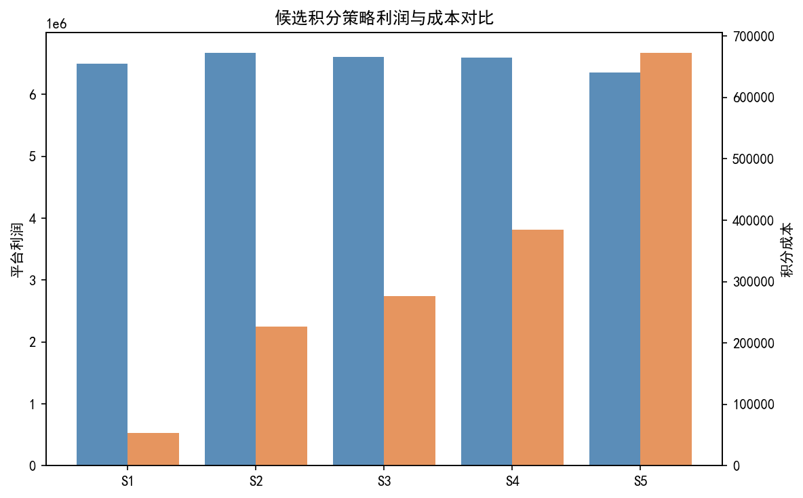

图 10 候选积分策略利润成本对比。图中柱形分别反映各候选策略的平台利润和积分成本。S5 的促活和收入提升更强，但积分成本明显高于其他策略；S4 在平台利润和成本压力之间表现更稳。

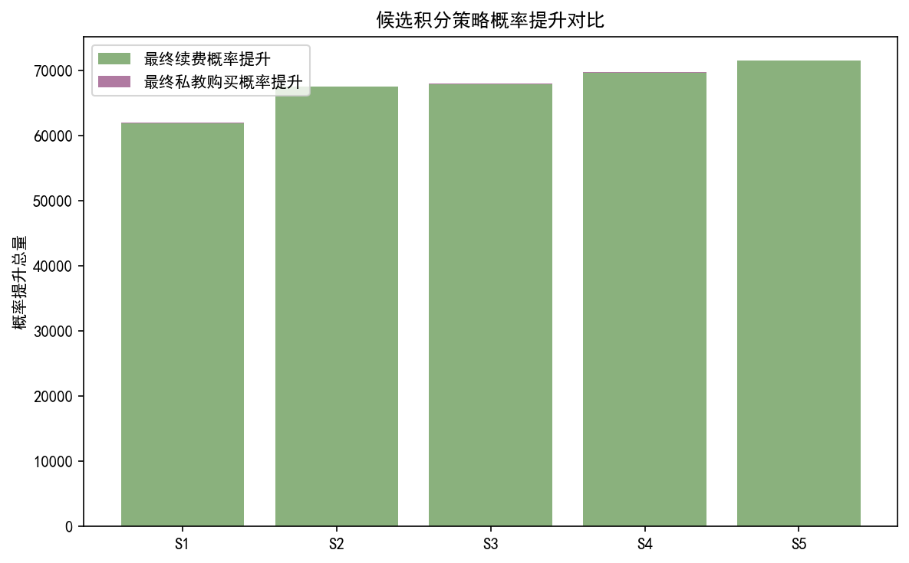

图 11 候选积分策略概率提升对比。图中展示各候选策略相对于 S0 的续费概率提升和私教购买概率提升。S5 在两类概率提升上均表现最强，S4 次之；S3 未显著超过 S2，说明私教专项激励并未转化为综合最优优势。

### 5.6 熵权-TOPSIS 综合评价结果

本节在经营约束下对候选策略进行熵权-TOPSIS 综合评价。具体计算流程已经在第 4.5 节给出：首先按利润非负和成本收入比约束筛选可行策略，再对平台利润、总活跃度提升、最终续费概率提升、最终私教购买概率提升、积分成本和成本收入比进行标准化，最后通过熵权法确定权重并计算 TOPSIS 综合得分。

基准 L2 两窗口下，S1-S5 均满足利润非负和成本约束。这里 L2 表示“积分实施窗口 + 1 个延期观察窗口”的两窗口模拟情景，即表 9 中的基准情景。表 11 给出基准 TOPSIS 结果。

表 11 基准两窗口下熵权-TOPSIS 策略排序。

| 排序 | 策略 | TOPSIS 得分 | 平台利润 | 私教收入提升 | 最终私教购买概率提升 |
|---:|---|---:|---:|---:|---:|
| 1 | S4 流失召回强化策略 | 0.5690 | 6594492.54 | 35677.73 | 45.50 |
| 2 | S5 高强度综合激励策略 | 0.5601 | 6351644.23 | 46473.08 | 76.50 |
| 3 | S3 私教转化强化策略 | 0.5097 | 6606853.05 | 16818.79 | 12.49 |
| 4 | S2 均衡促活策略 | 0.5077 | 6666323.97 | 15673.59 | 5.13 |
| 5 | S1 低补贴保留策略 | 0.3951 | 6492873.50 | -10868.00 | -31.88 |

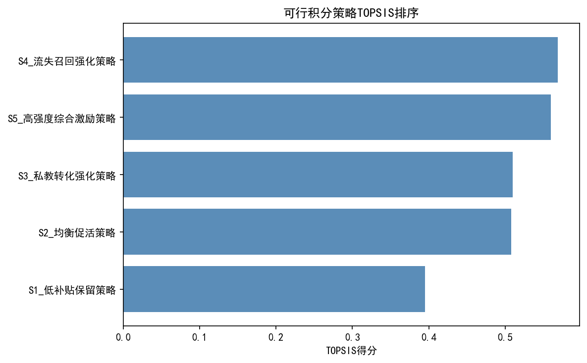

图 12 可行策略 TOPSIS 排序。S4 在基准两窗口综合评价中排名第一，S5 排名第二；S4 在平台利润和成本压力方面优于 S5，而 S5 在活跃提升和私教收入提升方面更强。

从基准 TOPSIS 结果看，S4 在综合评价中略高于 S5，主要原因是其在保持较高续费和私教收益提升的同时，积分成本和成本收入比明显低于 S5。S5 的优势来自更强的活跃提升和私教收入提升，但其补贴成本更高、平台利润低于 S4。因此，基准窗口已经支持 S4 作为稳健方案；同时，仍需结合多延期窗口和 $\kappa$ 参数灵敏度判断 S5 在较长观察期内是否具有进攻型价值。

---

## 6 模型检验与假设验证

本章用于检验数据构造、模型选择、仿真推理和策略推荐结论是否与本文假设相一致。由于本文没有真实积分干预实验，所有策略效果均属于“历史预测模型 + 积分响应假设”下的情景模拟结果。因此，第 6 章的重点不是证明积分机制已经产生真实因果效果，而是验证模型输入、预测工件、参数设定和综合排序在当前证据下是否具有可解释性和稳健性。

表 12 模型检验与假设验证汇总。

| 模块 | 检验内容 | 主要结论 | 边界说明 |
|---|---|---|---|
| 6.1 | 数据质量与商品分类规则 | 商品分类和建模数据可支撑主体分析 | 少量边界商品仍可能存在识别误差 |
| 6.2 | 续费标签与右删失处理 | H30 可作主窗口，H60 可作稳健性窗口 | 窗口内未续费不等于长期永久流失 |
| 6.3 | Cox 生存模型适用性 | Cox 适合处理右删失并解释风险比 | 未补做 Schoenfeld 检验，不写通过比例风险假设检验 |
| 6.4 | 续费预测稳健性 | SERF 与普通随机森林预测性能接近 | 预测性能不等于积分因果效应 |
| 6.5 | SERF 推理一致性 | 仿真推理特征构造与训练阶段一致 | 特征重要性只表示预测贡献 |
| 6.6 | 私教模型接入检验 | 增强私教模型可用于高潜用户排序和策略概率输入 | 稀有事件模型不宜按 Accuracy 评价 |
| 6.7 | 积分响应与参数敏感性 | 排序总体稳定，但受成本、响应和延续假设影响 | 参数不是历史数据直接识别的因果参数 |
| 6.8 | 策略推荐稳健性 | S4 为稳健主推荐，S5 为进攻型备选 | 不将单一 TOPSIS 第一写成唯一推荐依据 |

### 6.1 数据质量与商品分类规则合理性检验

数据质量检验首先关注订单分类、会员有效期识别和建模样本生成是否能够支撑后续续费、私教购买和策略模拟。本文将商品划分为会员商品、私教商品、入场/次卡及未知商品等类别，并据此构造会员权益周期和消费金额变量。商品分类结果显示，会员商品在订单数量中占主体，私教商品占比较低但金额贡献较高，需人工复核订单比例较小。该结果说明，基于规则识别的商品分类可以作为后续建模的近似业务标签。

同时，用户行为数据具有明显稀疏性，尤其线上互动、无氧训练和私教购买变量存在较多零值。本文将其解释为健身房真实业务中的低频行为，而不是简单视为异常值删除。后续模型通过状态划分、近因特征和类别不平衡处理吸收这种稀疏性。需要说明的是，少量边界商品可能存在分类误差，私教课包状态也只能作为估计变量，不能解释为真实剩余课时。

### 6.2 续费标签与右删失处理合理性检验

续费标签的核心是有限观察窗口下的时间边界。本文以 $H=30$ 天作为主分析窗口，以 $H=60$ 天作为稳健性窗口。若用户在会员权益结束后 $H$ 天内再次购买会员商品，则记为窗口内续费；若已经完整观察满 $H$ 天但未发生续费，则记为窗口内未续费；若权益结束后尚未观察满 $H$ 天且未观察到续费，则作为右删失样本处理。

H30 和 H60 续费样本均具有较大样本量，续费事件率和右删失比例处于可建模范围。二分类预测模型只使用完整观察样本，避免把真正右删失用户误标为未续费；Cox 生存模型保留右删失样本，用于刻画续费等待时间。该处理与第 4.1 节的续费标签定义一致。其边界是：窗口内未续费只能表示“在 $H$ 天窗口内未续费或存在较高流失风险”，不能等同于长期永久流失。

### 6.3 Cox 生存模型适用性与边界说明

Cox 比例风险模型的作用是处理右删失样本，并通过风险比解释变量与续费等待时间之间的关系。本文使用 Cox 模型刻画续费的时间到事件结构，同时输出关键变量风险比，用于说明用户状态、行为近因和消费特征与续费风险率之间的预测关系。

需要明确的是，Cox 模型不是后续策略仿真的主要概率输入。策略模拟阶段使用 SERF 工件推理续费概率，Cox 结果主要承担标签合理性、右删失处理和风险比解释功能。此外，本文当前未补做 Schoenfeld 残差检验，因此不能写成“Cox 模型通过比例风险假设检验”。更严谨的表述是：比例风险假设是 Cox 模型适用性边界，本文通过 Logistic-GAM、普通随机森林、状态增强随机森林以及 H30/H60 窗口对比，补充说明续费预测结论不依赖单一 Cox 假设。

### 6.4 续费模型预测稳健性检验

续费预测稳健性检验用于判断会员续费概率输入是否依赖单一模型或单一观察窗口。本文比较了 Cox、Logistic-GAM、普通随机森林和状态增强随机森林，并在 H30 与 H60 两个观察窗口下重复评估。AUC 用于衡量正负样本排序能力，F1 用于综合 Precision 与 Recall，Brier Score 用于评价概率校准误差。

结果显示，普通随机森林在纯预测指标上略优，状态增强随机森林与其 AUC 表现接近。H30 下，SERF 的 AUC 为 0.9701，普通随机森林 AUC 为 0.9759；H60 下，SERF 的 AUC 为 0.9640，普通随机森林 AUC 为 0.9679。由于 SERF 同时纳入用户状态、活跃提升空间、线上线下联动强度和近因-粘性状态向量等运营解释变量，虽然部分纯预测指标有所下降，但模型结构更契合积分策略模拟中的反事实特征更新，本文将其作为策略模拟中的续费概率推理工件，普通随机森林则保留为预测性能稳健性参照。

### 6.5 SERF 特征解释与仿真推理一致性检验

SERF（State-Enhanced Random Forest）指状态增强随机森林，即在普通随机森林续费模型基础上引入用户状态、活跃提升空间、线上线下联动强度和近因-粘性状态向量 $L_i$ 的续费预测模型。H30 特征重要性显示，当前会员类型、用户状态、活跃近因得分、到店近因得分、线下活跃度得分和活跃提升空间位居前列，说明 SERF 的主要解释变量与会员权益、运营状态、流失风险和促活空间高度一致。这里的 $L_i$ 包含购买粘性和行为近因得分，但论文解释中不把它等同于直接使用原始最近行为天数。

在仿真推理一致性方面，策略模拟程序使用训练完成后导出的 SERF 模型工件和特征元信息，并严格沿用训练阶段的特征顺序、缺失值处理和类别变量处理规则。快速推理路径与标准特征构造路径已在抽样数据上做一致性检查，最大概率差约为 $3.3\times10^{-16}$，属于浮点误差。由此可认为，策略模拟中的续费概率变化来自同一预测模型下 $Z_i,Gap_i^A,O2O_i,L_i$ 等状态增强特征的反事实更新，而不是另行设定的线性概率加成。

### 6.6 私教购买模型类别不平衡、先验校正与策略接入检验

私教购买模型面临极低频正样本问题。训练集中私教购买正样本比例约为 0.0825%，测试集中正样本比例约为 0.0910%。因此，本文不以 Accuracy 作为主要评价指标，而重点使用 PR-AUC、ROC-AUC、TopK Precision、TopK Recall、Lift、F1、Recall、Precision 和 Brier Score。其中，PR-AUC 更适合评价极低频事件的正样本识别能力，TopK 指标更符合运营中“优先触达高潜用户”的业务场景。

本文最终采用“全量增强特征 + CaseControl-HistGBDT”作为增强私教购买模型。该术语表示：在基础消费和行为变量之外，加入用户状态、私教历史、近因-粘性状态得分、无氧训练、线上互动和价格估计等全量增强特征；同时采用 case-control 抽样缓解正负样本极度不平衡，并使用直方图梯度提升决策树 HistGBDT 进行训练。由于 case-control 抽样改变训练样本先验，策略模拟阶段需按真实先验和抽样先验进行概率校正。

最佳增强模型测试集 PR-AUC 为 0.2399，ROC-AUC 为 0.8711，Brier Score 为 0.000769，F1 为 0.3385；Top500 命中 132 个私教购买正样本，Precision@500 为 0.264，Recall@500 为 0.2882，Lift@500 约为 290.21。该结果说明模型适合作为高潜私教用户排序和策略模拟概率输入。需要强调的是，策略后的私教购买概率变化来自反事实特征更新后的模型推理，不能解释为积分对私教购买的真实因果效应。

### 6.7 积分响应函数合理性与参数敏感性检验

积分响应函数采用边际递减形式，用于描述积分激励对用户活跃提升的情景假设。参数 $\alpha_{g,j}$ 表示用户组 $g$ 在策略 $r_j$ 下的最大可实现活跃提升空间，$\beta_{g,j}$ 表示相应积分敏感度，二者由响应强度 $\rho_g$、参考响应比例 $q_g$、参考积分水平 $P_g^{ref}$ 以及策略缩放系数 $s_j^\rho,s_j^q$ 间接确定。这些参数并非由历史数据直接识别出的因果效应，而是用于构造可比较的模拟情景。

为检验策略排序是否对关键假设过度敏感，本文进行了单因素灵敏度、多延期窗口灵敏度和 $\kappa$ 语义更新参数灵敏度分析。单因素分析覆盖单位积分抵扣金额、积分兑换概率、成本收入比上限、响应强度、参考响应比例和活跃延续系数。在 13 个单因素情景中，S5 排名第一 11 次，但在部分成本和响应参数下，S4 或 S3 会成为最优策略，说明不能将 S5 写成所有参数下的稳定最优。

多延期窗口和 $\kappa$ 参数分析进一步表明，S5 在较长观察窗口和反事实特征联动较强的情景中综合竞争力更强，但短期补贴压力较高；S4 在更多 $\kappa$ 参数组合中出现相对 S0 的累计利润反超，成本压力和利润稳健性更好。由此可见，积分响应函数的设置能够支撑策略比较，但策略结论仍需结合参数边界进行解释。

### 6.8 策略推荐稳健性验证与推荐方案确定

策略推荐稳健性检验的目的，是避免将单一基准 TOPSIS 排名直接等同于最终策略推荐。本文从三个层面进行验证：第一，比较基准窗口下综合得分、平台利润和积分成本之间的权衡；第二，检验多延期窗口和 $\kappa$ 语义更新参数扰动下策略排序是否稳定；第三，将 TOPSIS 中的私教相关指标从“最终私教购买概率提升”替换为“私教收入提升”，检验排序是否依赖单一概率人数指标。

基准 TOPSIS 中 S4 排名第一，且平台利润更高、成本收入比更低。多延期窗口和 $\kappa$ 参数灵敏度分析表明，S5 在较长期窗口和部分反事实特征放大假设下具有更强综合竞争力，但 S4 的利润改善更稳，短期补贴压力更低。因此，S4 可作为稳健主推荐，S5 更适合解释为进攻型备选策略。

进一步地，本文将 TOPSIS 中的“最终私教购买概率提升”替换为“私教收入提升”进行替代指标稳健性检验。“最终私教购买概率提升”表示策略后私教购买概率相对 S0 的总体提升，可近似理解为期望私教购买人数提升；“私教收入提升”则进一步乘以用户预计私教价格，更强调收入贡献。替代检验结果显示，基准窗口排序保持为 S4、S5、S2、S3、S1；普通多延期窗口中，S5 排名第一 22 次，S4 排名第一 6 次；$\kappa$ 多延期窗口中，S5 排名第一 122 次，S4 排名第一 18 次。S3 在三类检验中均未稳定成为最优策略。

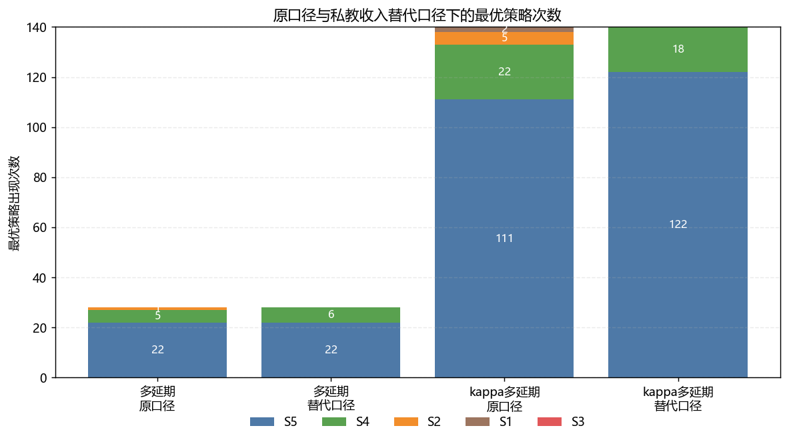

图 13 TOPSIS 替代指标最优策略次数对比。私教收入替代指标下，S4 在基准窗口中仍排名第一，S5 在多延期和 $\kappa$ 多延期窗口中排名第一次数更多，说明两类策略的优势侧重点不同。

综上，本文形成如下策略推荐结论：S4 流失召回强化策略作为稳健主推荐方案，S5 高强度综合激励策略作为进攻型备选方案。S4 的依据是基准和替代基准 TOPSIS 均排名第一，补贴目标更集中、成本压力较低、利润稳健性更好；S5 的依据是多延期和 $\kappa$ 多延期窗口下综合竞争力更强，综合促活、续费提升和私教收入提升更高，但需要平台承担更高补贴。S3 不宜作为综合推荐方案，只适合作为私教转化专项备选。

---

## 7 灵敏度分析

### 7.1 单参数灵敏度分析

本文首先对积分策略中的关键情景参数进行单因素灵敏度分析。所谓单因素灵敏度分析，是指每次只改变一个参数，其余参数保持基准值不变，从而观察策略排序和利润指标是否发生显著变化。本文考察的参数包括：单位积分抵扣金额 $c$、积分兑换概率 $RedeemProb$、成本收入比上限 $\eta$、响应强度参数 $\rho_g$、参考响应比例 $q_g$ 和活跃延续系数 $\gamma_A$。

其中，$c$ 表示每单位积分可抵扣的金额，直接影响积分成本；$RedeemProb$ 表示用户获得积分后实际用于抵扣的概率；$\eta$ 表示平台可接受的成本收入比上限；$\rho_g$ 决定用户组 $g$ 的最大可实现活跃提升空间；$q_g$ 表示参考积分水平下用户组 $g$ 的预期响应比例；$\gamma_A$ 表示积分激励结束后活跃提升在延期窗口中的保留程度。

结果显示，在 13 个单因素情景中，S5 排名第一 11 次，说明其综合促活排序总体较强。但当单位积分抵扣金额较低时，S4 排名第一；当参考响应比例乐观时，S3 排名第一。这表明最优策略并非对所有参数完全不敏感。论文中应将 S5 表述为“多数情景下综合表现较强”，而不能写成“在所有参数下稳定最优”。

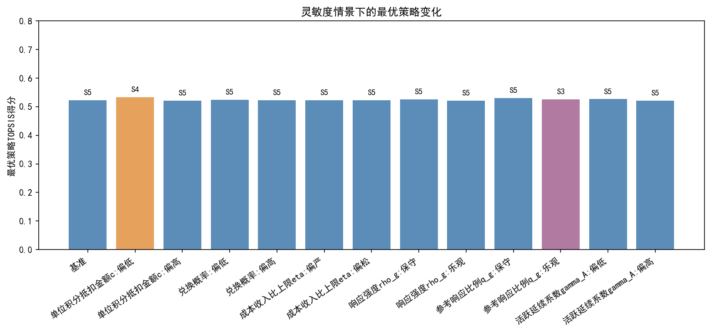

图 14 灵敏度情景最优策略变化。多数情景下 S5 表现较强，但在部分成本或响应假设下，S4 或 S3 可能上升为最优策略。

### 7.2 多延期窗口灵敏度分析

多延期窗口灵敏度分析用于检验积分激励结束后，若用户活跃提升存在残余惯性，策略排序和累计利润差是否发生变化。本文以第 4.5 节定义的 $D$ 表示积分实施期之后继续观察的延期窗口数量，总窗口数等于 $1+D$。窗口 1 计入积分成本，延期窗口不再新增积分成本，但保留部分活跃提升并重新推理续费概率和私教购买概率。

活跃延续的计算采用第 4.3 节式（27）。其中，$\gamma_A$ 越大，表示积分激励带来的活跃提升在延期窗口中保留得越多；$\gamma_A$ 越小，表示激励效应衰减越快。

结果显示，在总窗口数为 2 时，S5 相对 S0 的利润差仍为负；当延期观察窗口数达到 2 个，即总窗口数达到 3 个时，S5 在所有测试的活跃延续系数情景下均开始相对 S0 出现累计利润反超。

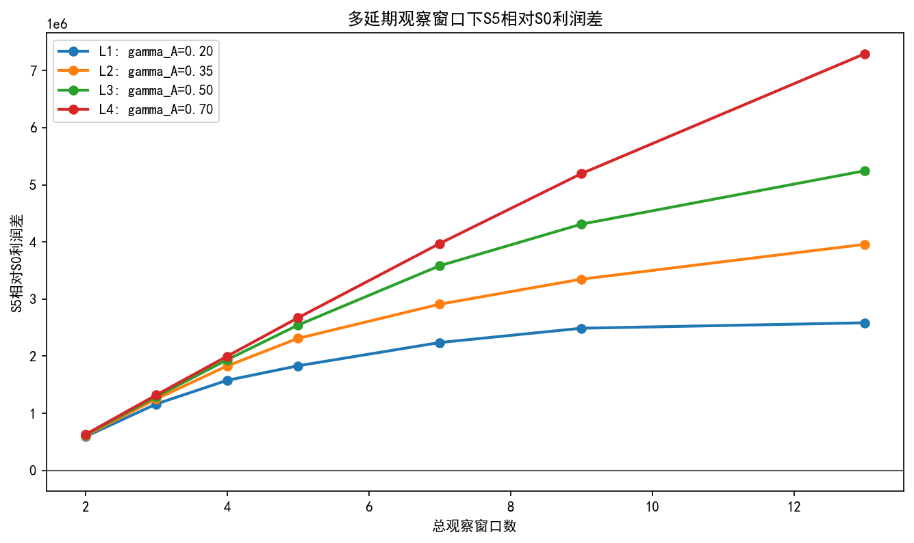

图 15 多延期窗口 S5 相对 S0 利润差。随着观察窗口延长，S5 的累计利润劣势逐渐缩小并可能转为正值，说明高强度激励策略存在长期收益反超可能。

在 28 个“延续活跃系数 × 延期窗口数”组合中，S5 排名第一 22 次，S4 排名第一 5 次，S2 排名第一 1 次。多延期结果说明，随着观察窗口延长，S5 的长期综合竞争力明显增强。结合基准窗口下 S4 排名第一且利润成本表现更稳，本文将 S4 定位为稳健落地方案，将 S5 定位为长期进攻型备选。

### 7.3 $\kappa$ 语义更新参数灵敏度分析

在策略模拟中，积分首先直接提升用户活跃度，但 SERF 续费模型和增强私教购买模型还包含线上互动、消费结构、无氧训练和行为近因等特征。为描述活跃提升对这些相关特征的联动影响，本文使用第 4.3 节式（28）定义的 $\kappa$ 语义更新函数。其中，$\Delta A_{i,k}(r)$ 表示用户 $i$ 在第 $k$ 个窗口中由策略 $r$ 带来的活跃提升，$A_{i,t}$ 表示用户原始活跃水平，$\gamma_\kappa$ 控制活跃提升向其他反事实特征的放大强度，$\epsilon_\kappa$ 是平滑项，用于避免低活跃用户分母过小导致放大过强。本文测试 $\gamma_\kappa\in\{0.25,0.50,0.75,1.00\}$ 和 $\epsilon_\kappa\in\{10^{-9},10^{-4},10^{-3},10^{-2},5\times10^{-2}\}$，共形成 20 个 $\kappa$ 参数情景。

短期 $\kappa$ 灵敏度分析显示，S5 在 20 个情景中排名第一 11 次，S4 排名第一 9 次。S5 相对 S0 的利润差在 12 个情景中为正，范围为 -29.59 万元至 83.44 万元；作为对照，S4 相对 S0 的利润差在 19 个情景中为正，范围为 -4.11 万元至 109.33 万元。该结果说明 S4 对 $\kappa$ 参数扰动下的短期利润稳健性更强。

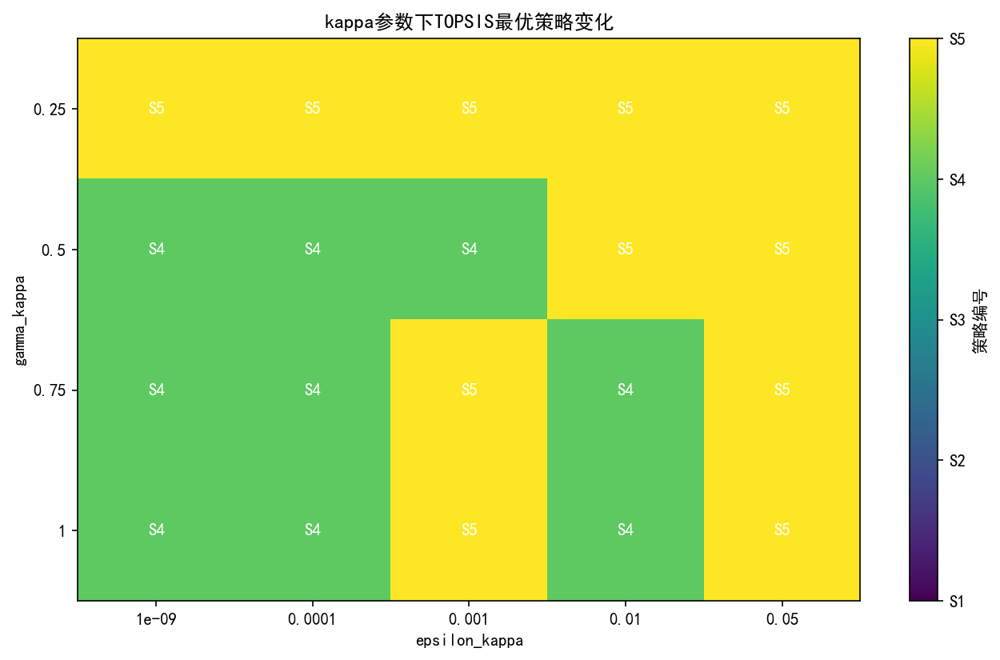

图 16 $\kappa$ 参数下最优策略变化热力图。不同 $\gamma_\kappa$ 和 $\epsilon_\kappa$ 组合会影响 S4、S5 的最优策略归属，但 S5 在多数短期情景中仍具有较强综合排序。

$\kappa$ 多延期窗口分析固定 $\gamma_A=0.35$，并在 7 个延期窗口数下重复上述 20 组 $\kappa$ 参数，共形成 140 个“$\kappa$ 参数 × 延期窗口数”组合。结果显示，S5 排名第一 111 次，S4 排名第一 22 次，S2 排名第一 5 次，S1 排名第一 2 次。与此同时，20 组 $\kappa$ 参数中，S5 和 S4 均在测试的多延期窗口内出现相对 S0 的累计利润反超；在 140 个组合中，S5 相对 S0 利润差为正 128 次，S4 为正 139 次，说明 S5 的长期综合排序更强，而 S4 的利润稳健性更好。

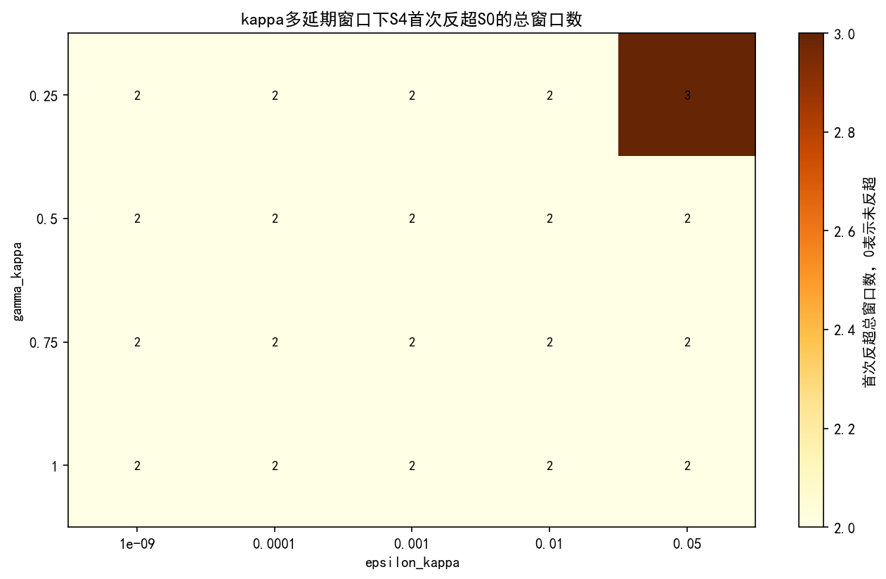

图 17 $\kappa$ 多延期窗口 S4 首次反超窗口热力图。S4 在更多 $\kappa$ 参数组合中出现相对 S0 的累计利润反超，说明其作为稳健落地方案具有较强成本和利润优势。

### 7.4 TOPSIS 替代指标稳健性分析

TOPSIS 指标选择可能影响最终策略排序。为避免最终推荐过度依赖“最终私教购买概率提升”这一概率人数指标，本文构造替代指标稳健性检验。原 TOPSIS 正向指标为平台利润、总活跃度提升、最终续费概率提升和最终私教购买概率提升；替代指标方案将“最终私教购买概率提升”替换为“私教收入提升”，其余指标和负向指标保持不变。

原指标集合 $\mathcal{I}_0$ 和替代指标集合 $\mathcal{I}_1$ 已在第 4.5 节式（47）和式（48）中给出。其中 $\Delta PT$ 表示最终私教购买概率提升，$\Delta R_p$ 表示私教收入提升。两组指标中，$\Pi$、$\Delta A$、$\Delta Renew$、$\Delta PT$ 和 $\Delta R_p$ 为正向指标，$C_{point}$ 和 $CostRate$ 为负向指标。

替代检验结果显示，基准窗口下排序保持不变，仍为 S4、S5、S2、S3、S1；普通多延期窗口中 S5 第一 22 次、S4 第一 6 次；$\kappa$ 多延期窗口中 S5 第一 122 次、S4 第一 18 次。

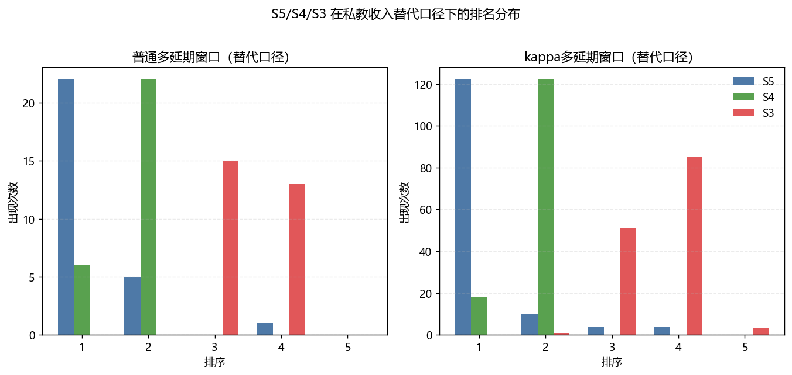

图 18 TOPSIS 替代指标下 S5/S4/S3 排名分布。S3 在替代指标方案下仍未稳定成为最优策略，说明其更适合作为私教转化专项备选。

### 7.5 灵敏度分析小结

综合各类灵敏度检验可以得到以下结论。第一，S4 在基准 TOPSIS 和替代基准 TOPSIS 中均排名第一，且积分成本较低、平台利润更稳，适合作为稳健主推荐。第二，S5 在综合促活、续费提升和私教收入提升方面具有较强优势，尤其在较长观察窗口和 $\kappa$ 多延期窗口情景下竞争力突出，适合作为进攻型备选。第三，S3 在部分响应参数乐观情景下可能上升，但在基准、多延期和替代指标检验中均未稳定成为最优，因此不宜作为综合主推荐。

---

## 8 结论与运营建议

本文基于智能健身房用户行为数据，构建了会员续费预测、私教购买预测、积分响应模拟和熵权-TOPSIS 综合评价模型。主要结论如下：

1. 用户状态分布中流失风险用户占比较高，且自然状态转移中流失风险用户保持原状态的概率较高，说明平台需要重点设计召回型激励策略。
2. 状态增强随机森林在会员续费预测中与普通随机森林的 AUC 表现接近，虽然部分纯预测指标略低，但其特征重要性更集中于用户状态、近因-粘性状态和活跃提升空间等可解释运营变量，因此更契合积分策略情景模拟，适合作为策略模拟中的续费概率推理模型。
3. 私教购买属于极低频事件，增强私教购买模型更适合作为高潜用户排序工具，而不是解释所有用户是否购买私教的因果模型。
4. 基准 TOPSIS 结果显示，S4 流失召回强化策略综合得分最高，平台利润和成本控制表现较好。
5. 多延期窗口、$\kappa$ 参数灵敏度和替代指标稳健性分析表明，S5 高强度综合激励策略在较长观察窗口中综合竞争力更强，但 S4 在成本控制和利润稳健性方面更适合优先落地。

基于上述结论，本文提出如下运营建议：

第一，平台若追求稳健落地，应优先采用 S4 流失召回强化策略。该策略将补贴集中于流失风险用户，能够在控制成本的同时提升召回效果和平台利润稳健性。

第二，若平台愿意承担较高补贴成本，并希望在较长观察窗口内追求强促活、私教转化和长期召回，可以将 S5 高强度综合激励策略作为进攻型备选。

第三，S3 私教转化强化策略不宜作为综合主推荐，但可以面向私教潜在用户作为专项策略使用，例如结合无氧训练、历史私教消费和高潜用户排序结果进行定向触达。

第四，平台应控制积分兑换成本和抵扣比例上限，避免短期补贴过高导致利润承压。积分方案上线后，应通过真实 A/B 实验进一步验证积分机制对活跃、续费和私教购买的实际因果效果。

---

## 参考文献

此处后续根据积分激励、健康行为干预、客户忠诚计划、生存分析和机器学习预测模型等相关文献补充。
